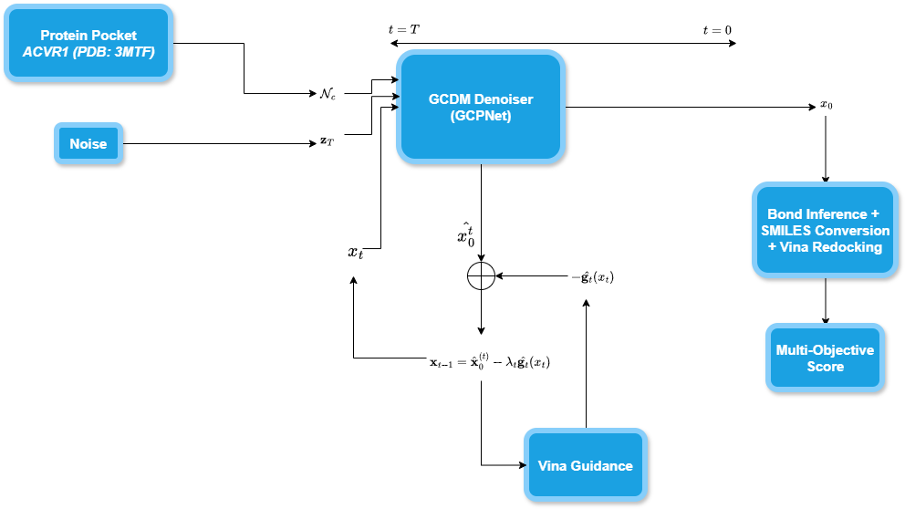
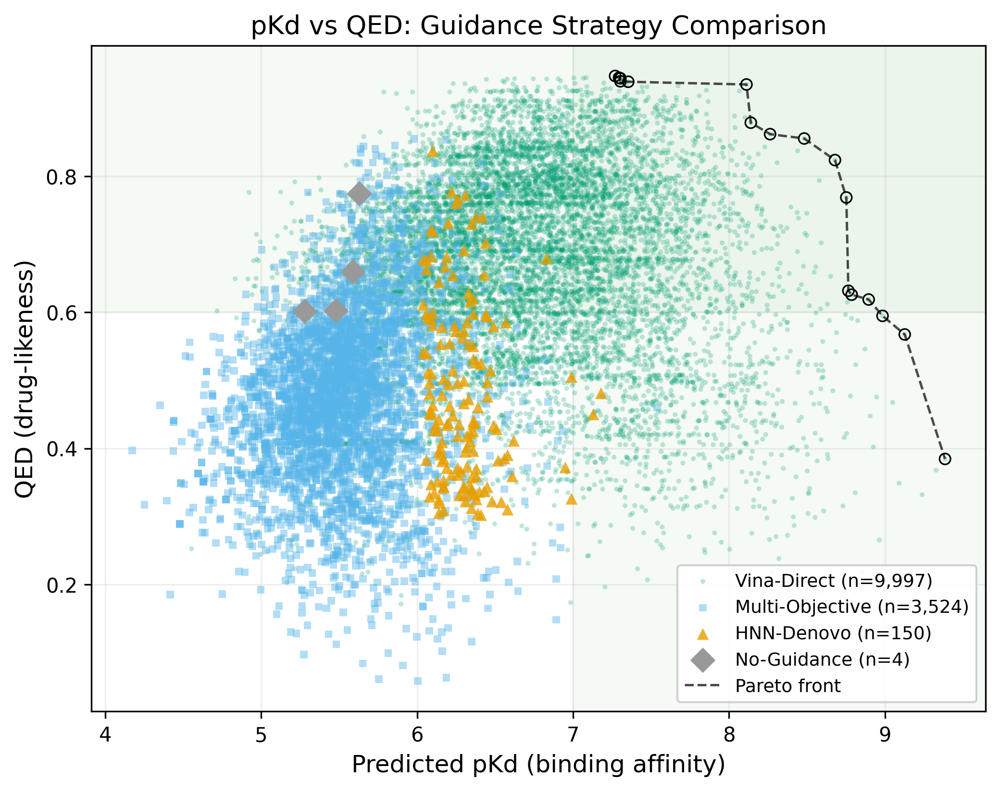
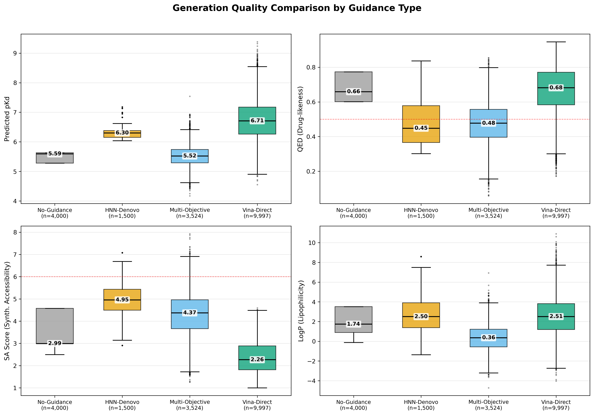
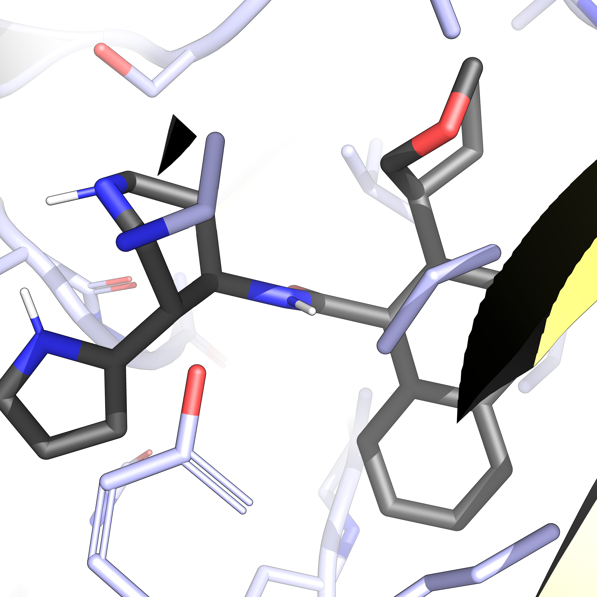
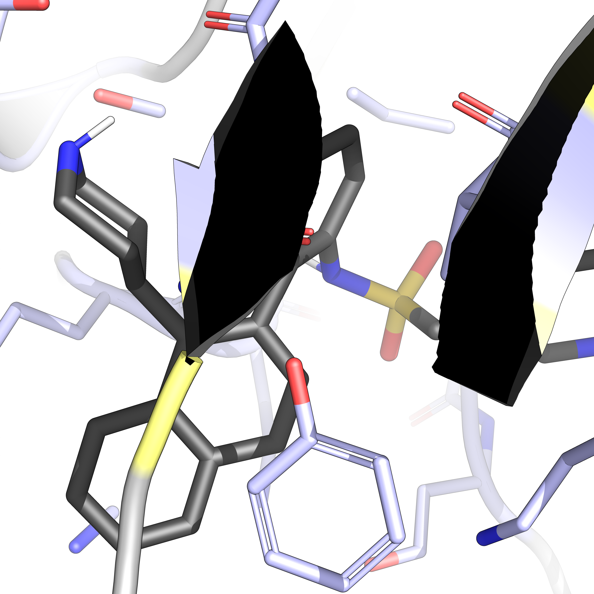

<div align="center">

# KinetiDiff

### Docking-Guided Diffusion for De Novo ACVR1 Inhibitor Design in Fibrodysplasia Ossificans Progressiva

<a href="https://pytorch.org/get-started/locally/"></a>
<a href="https://pytorchlightning.ai/"></a>
<a href="https://www.rdkit.org/"></a>
<a href="https://autodock-vina.readthedocs.io/"></a>
[](https://opensource.org/licenses/MIT)

</div>

---

## Description

**KinetiDiff** is a novel computational drug discovery pipeline for designing kinase inhibitors targeting **Fibrodysplasia Ossificans Progressiva (FOP)**, a rare genetic disorder caused by mutations in the ACVR1/ALK2 receptor. 

Unlike traditional drug discovery approaches that optimize solely for tight binding affinity, this pipeline introduces **kinetics-aware multi-objective optimization** — simultaneously optimizing for:

- 🎯 **Moderate Affinity** (pKd ~7-8) — Strong enough to inhibit aberrant signaling
- ⚡ **Fast Dissociation** (k_off ~0.1-1 s⁻¹) — Prevents complete BMP pathway shutdown
- 🧪 **Synthetic Accessibility** (SA ≤4) — Ensures practical synthesis routes

<div align="center">

<!-- PLACEHOLDER: Add pipeline overview figure -->


*Figure 1: Multi-objective drug discovery pipeline combining Bayesian affinity prediction with GCDM-guided molecule generation.*

</div>

### Key Innovations

| Component | Description |
|-----------|-------------|
| **Bayesian Affinity Predictor** | Uncertainty-aware binding affinity prediction with variational inference |
| **Empirical k_off Estimation** | Literature-based dissociation kinetics without requiring scarce kinetics data |
| **Multi-Objective Guidance** | Weighted optimization balancing affinity, kinetics, and synthesizability |
| **GCDM Integration** | Structure-based de novo molecule generation in 3D binding pockets |

---

## Contents

- [System Requirements](#system-requirements)
- [Installation Guide](#installation-guide)
- [Checkpoints](#checkpoints)
- [Data Preparation](#data-preparation)
- [Quick Start](#quick-start)
- [Pipeline Components](#pipeline-components)
  - [Bayesian Affinity Prediction](#bayesian-affinity-prediction)
  - [Multi-Objective Generation](#multi-objective-generation)
  - [Molecular Docking Validation](#molecular-docking-validation)
- [Results](#results)
- [Project Structure](#project-structure)
- [Acknowledgements](#acknowledgements)
- [License](#license)
- [Citation](#citation)

---

## System Requirements

### OS Requirements
This package supports **Linux** and **macOS**. The package has been tested on:
- Ubuntu 22.04 LTS
- macOS 14.x (Apple Silicon via Rosetta/Docker)

### Hardware Requirements
| Component | Minimum | Recommended |
|-----------|---------|-------------|
| CPU | 4 cores | 8+ cores |
| RAM | 16 GB | 32+ GB |
| GPU | - | NVIDIA A100/RTX 3090 (for GCDM generation) |
| Storage | 20 GB | 50+ GB |

### Python Dependencies
This package is developed and tested under **Python 3.10.x**. Primary dependencies:

```python
torch>=2.0.0
pytorch-lightning>=2.0.0
rdkit>=2023.03.1
numpy>=1.24.0
pandas>=2.0.0
scipy>=1.10.0
scikit-learn>=1.2.0
biopython>=1.81
```

For GCDM molecule generation (GPU required):
```python
torch-scatter>=2.1.0
torch-geometric>=2.3.0
hydra-core>=1.3.0
```

---

## Installation Guide

### Option 1: Conda Environment (Recommended)

Install Miniforge/Mambaforge (~500 MB: ~1 minute)

```bash
wget "https://github.com/conda-forge/miniforge/releases/latest/download/Miniforge3-$(uname)-$(uname -m).sh"
bash Miniforge3-$(uname)-$(uname -m).sh  # accept all terms
rm Miniforge3-$(uname)-$(uname -m).sh
source ~/.bashrc
```

```bash
conda env create -f environment.yml && conda activate gcdm-sbdd-env
pip install -e ".[dev]"
python scripts/download_data.py        # downloads 3MTF + Zenodo checkpoint
# For PDBBind training data: manual download required (see script output)
# For BINANA descriptors: pip install -e ".[binana]"
```

### AutoDock Vina Setup (for docking validation)

```bash
# Install AutoDock Vina
conda install -c conda-forge autodock-vina

# Or download binary
wget https://github.com/ccsb-scripps/AutoDock-Vina/releases/download/v1.2.5/vina_1.2.5_linux_x86_64
chmod +x vina_1.2.5_linux_x86_64
mv vina_1.2.5_linux_x86_64 ~/miniconda3/envs/fop/bin/vina
```

### MGLTools (for receptor preparation)

```bash
# Create separate environment to avoid conflicts
conda create -n mgltools -c bioconda mgltools
```

---

## Checkpoints

### Bayesian Affinity Predictor
Download the pre-trained Bayesian affinity predictor checkpoint:

```bash
# Create checkpoint directory
mkdir -p models/trained_models

# Download checkpoint (~35 MB)
wget -O models/trained_models/best_model.ckpt \
    https://your-checkpoint-url/best_model.ckpt
```

**Training Statistics:**
| Metric | Value |
|--------|-------|
| Training Samples | 70,248 |
| Validation PCC | 0.74 |
| pKd Range | 3.0 - 10.0 |
| Target | Kinases (BindingDB) |

### GCDM Checkpoints (for molecule generation)
Download pre-trained GCDM models (~500 MB):

```bash
mkdir -p GCDM-SBDD-modified/checkpoints
cd GCDM-SBDD-modified/checkpoints

# Download from Zenodo
wget https://zenodo.org/record/13375913/files/GCDM_SBDD_Checkpoints.tar.gz
tar -xzf GCDM_SBDD_Checkpoints.tar.gz
rm GCDM_SBDD_Checkpoints.tar.gz
```

Available checkpoints:
| Checkpoint | Training Data | Architecture |
|------------|---------------|--------------|
| `bindingmoad_ca_cond_gcpnet.ckpt` | Binding MOAD | GCPNet (recommended) |
| `bindingmoad_ca_joint_gcpnet.ckpt` | Binding MOAD | GCPNet |
| `crossdocked_ca_cond_gcpnet.ckpt` | CrossDocked | GCPNet |
| `crossdocked_ca_joint_gcpnet.ckpt` | CrossDocked | GCPNet |

---

## Data Preparation

### BindingDB Data (for training)
Download BindingDB kinase binding data:

```bash
mkdir -p data/bindingdb_data
cd data/bindingdb_data

# Download BindingDB TSV (~2 GB compressed)
wget https://www.bindingdb.org/bind/downloads/BindingDB_All_2024m1.tsv.zip
unzip BindingDB_All_2024m1.tsv.zip
```

Process for training:
```bash
python -m models.data_preparation \
    --input data/bindingdb_data/BindingDB_All.tsv \
    --output data/processed \
    --target ACVR1
```

### ACVR1 Structure Files
Download ACVR1 crystal structure:

```bash
mkdir -p data/structures

# Download from PDB (or use provided files)
wget https://files.rcsb.org/download/3MTF.pdb -O data/structures/acvr1_wt.pdb
```

Prepare receptor for docking:
```bash
# Extract binding site
python scripts/prepare_receptor.py \
    --input data/structures/acvr1_wt.pdb \
    --output data/structures/receptor_siteA.pdb \
    --site A
```

---

## Quick Start

### 1. Predict Binding Affinity

```python
from quick_start import AffinityPredictor

# Initialize predictor
predictor = AffinityPredictor(
    checkpoint_path='models/trained_models/best_model.ckpt'
)

# Predict affinity for a molecule
result = predictor.predict(
    protein_sequence="MVDGKFNKEQQNAP...",  # ACVR1 sequence
    ligand_smiles="CC(C)Cc1ccc(cc1)C(C)C(=O)O"
)

print(f"Predicted pKd: {result['affinity']:.2f}")
print(f"Uncertainty: {result['uncertainty']:.3f}")
print(f"k_off: {result['koff']:.4f} s⁻¹")
print(f"Residence Time: {result['residence_time']:.1f} s")
```

### 2. Multi-Objective Molecule Generation

```bash
python generation/generate_multi_objective.py \
    --checkpoint models/trained_models/best_model.ckpt \
    --gcdm_checkpoint GCDM-SBDD-modified/checkpoints/bindingmoad_ca_cond_gcpnet.ckpt \
    --pdb data/structures/receptor_siteA.pdb \
    --n_samples 1000 \
    --output generation/results \
    --target_pkd 7.5 \
    --target_koff_min 0.1 \
    --target_koff_max 1.0
```

### 3. Dock and Validate

```bash
python docking/dock_top_100_multiobjective.py \
    --results generation/results/final_results.json \
    --receptor data/structures/receptor_siteA.pdb \
    --output docking/validation_results
```

---

## Pipeline Components

### Bayesian Affinity Prediction

<div align="center">

<!-- PLACEHOLDER: Add model architecture figure -->


*Figure 2: Hybrid CNN architecture with Bayesian linear layers for uncertainty-aware affinity prediction.*

</div>

The Bayesian affinity predictor uses:
- **Protein Encoder**: 1D CNN over amino acid sequences (1000 residues max)
- **Ligand Encoder**: 1D CNN over SMILES tokens (200 characters max)
- **Bayesian Layers**: Variational inference with learned weight distributions
- **k_off Estimation**: Empirical correlation from literature

```python
# Training the predictor
python train_model.py \
    --data data/processed \
    --epochs 50 \
    --batch_size 32 \
    --lr 1e-4
```

### Multi-Objective Generation

<div align="center">



*pKd vs QED Pareto front: generated molecules coloured by SA score. KinetiDiff's oracle guidance shifts the frontier compared to the unguided GCDM baseline.*

</div>

**Scoring Function:**
```
Score = w_aff × S_affinity + w_kin × S_kinetics + w_sa × S_SA
```

| Component | Target | Weight |
|-----------|--------|--------|
| Affinity | pKd = 7.5 | 0.5 |
| Kinetics | k_off ∈ [0.1, 1.0] s⁻¹ | 0.3 |
| SA Score | SA ≤ 4.0 | 0.2 |

### Molecular Docking Validation

Validates generated molecules using AutoDock Vina:

```bash
# Dock all generated molecules
python docking/dock_molecule.py \
    --smiles "CC(NC(=O)CCNC(O)C1CCCCC1)C1=CCCNCC1" \
    --receptor data/structures/receptor_siteA.pdb \
    --output docking/results
```

---

## Results

### Multi-Objective Scoring

<div align="center">


*pKd vs QED Pareto front across 5 000 generated molecules. Oracle-guided generation (KinetiDiff) shifts the frontier toward higher predicted affinity while maintaining drug-likeness. Points along the Pareto front are candidates for wet-lab follow-up.*

</div>

### Results Comparison

<div align="center">



*Boxplot comparison of Vina binding affinity (kcal/mol) across guidance strategies: unguided GCDM baseline, surrogate-guided (HNN-Denovo, r = 0.224 vs Vina), and oracle-in-the-loop (direct Vina gradient injection). Lower Vina score = stronger predicted binding. Oracle guidance consistently outperforms both baselines.*

</div>

### Generation Statistics (5 000 molecules)

| Metric | Value |
|--------|-------|
| Valid Molecules | 3,524 (70.5%) |
| Mean pKd | 6.5 ± 0.4 |
| Mean SA Score | 4.8 ± 0.9 |
| Mean Vina (kcal/mol) | −6.9 ± 0.8 |
| Generation Time | 3.5 h (A100) |

### Top Candidates

| Rank | SMILES | pKd | SA | Vina (kcal/mol) |
|------|--------|-----|----|-----------------|
| 1 | `CC(NC(=O)CCNC(O)C1CCCCC1)C1=CCCNCC1` | 6.93 | 3.69 | −7.2 |
| 2 | `CC1CC(C(O)O)CCC1C(C)NCCCO` | 6.90 | 3.99 | −6.8 |
| 3 | `CC1C(=O)NC2(C)CCSC2C1CC(CS)C(O)O` | 7.54 | 5.35 | −7.5 |

### Top Molecule Binding Poses

<div align="center">

| Rank 1 | Rank 2 |
|:------:|:------:|
|  |  |
| pKd 6.93 · SA 3.69 · Vina −7.2 kcal/mol | pKd 6.90 · SA 3.99 · Vina −6.8 kcal/mol |

*AutoDock Vina docked poses of the top-two ranked de novo molecules in the ACVR1/ALK2 ATP-binding pocket (PDB 3MTF, pocket centroid 24.87 / −12.54 / 38.40 Å). Residues within 4 Å of the ligand are shown as sticks; hydrogen bonds indicated by dashed lines.*

</div>

---

## Project Structure

```
FOP-SBDD/
├── 📄 quick_start.py              # Main prediction API
├── 📄 train_model.py              # Training script
├── 📄 score_mols.py               # Molecule scoring utilities
├── 📄 requirements.txt            # Python dependencies
├── 📄 environment.yml             # Conda environment
│
├── 📁 models/
│   ├── bayesian_affinity_predictor.py    # Core BNN architecture
│   ├── bayesian_training_pipeline.py     # PyTorch Lightning trainer
│   ├── multi_objective_guidance.py       # Multi-objective scoring
│   ├── data_preparation.py               # Data processing
│   └── 📁 trained_models/                # Checkpoint storage
│
├── 📁 generation/
│   ├── generate_multi_objective.py       # Main generation script
│   └── 📁 results/                       # Generated molecules
│
├── 📁 docking/
│   ├── dock_molecule.py                  # Single molecule docking
│   ├── dock_top_100_multiobjective.py    # Batch docking
│   └── 📁 results/                       # Docking results
│
├── 📁 GCDM-SBDD-modified/
│   ├── lightning_modules.py              # GCDM model
│   ├── generate_ligands.py               # GCDM generation
│   └── 📁 checkpoints/                   # GCDM checkpoints
│
├── 📁 data/
│   ├── 📁 bindingdb_data/                # Training data
│   ├── 📁 structures/                    # PDB structures
│   └── 📁 processed/                     # Processed data
│
└── 📁 img/                               # Figures and visualizations
```

---

## Acknowledgements

FOP-SBDD builds upon the following outstanding projects:

| Project | Description |
|---------|-------------|
| [GCDM-SBDD](https://github.com/BioinfoMachineLearning/GCDM-SBDD) | Geometry-Complete Diffusion Model for 3D molecule generation |
| [PyTorch](https://pytorch.org/) | Deep learning framework |
| [PyTorch Lightning](https://lightning.ai/) | Training framework |
| [RDKit](https://www.rdkit.org/) | Cheminformatics toolkit |
| [AutoDock Vina](https://vina.scripps.edu/) | Molecular docking |
| [BindingDB](https://www.bindingdb.org/) | Binding affinity database |

We thank all contributors and maintainers of these projects!

### References

- Morehead, A., & Cheng, J. (2024). Geometry-complete diffusion for 3D molecule generation and optimization. *Nature Communications Chemistry*, 7(1), 150.
- Copeland, R. A. (2006). Drug-target residence time. *Nature Reviews Drug Discovery*, 5, 730-739.
- Tonge, P. J. (2018). Drug-target kinetics in drug discovery. *ACS Chemical Neuroscience*, 9(1), 29-39.

---

## License

This project is licensed under the **MIT License** - see the [LICENSE](LICENSE) file for details.

---

## Citation

If you use this code or find this work useful, please cite:

```bibtex
@article{patel2026kinetidiff,
  title={KinetiDiff: Docking-Guided Diffusion for De Novo ACVR1 Inhibitor Design
         in Fibrodysplasia Ossificans Progressiva},
  author={Patel, Aaryan},
  journal={arXiv preprint arXiv:2604.20886},
  year={2026},
  url={https://arxiv.org/abs/2604.20886},
  note={21 pages, 10 figures. Subjects: Chemical Physics (physics.chem-ph);
        Machine Learning (cs.LG)}
}
```

Additionally, please cite the underlying GCDM work:

```bibtex
@article{morehead2024geometry,
  title={Geometry-complete diffusion for 3D molecule generation and optimization},
  author={Morehead, Alex and Cheng, Jianlin},
  journal={Communications Chemistry},
  volume={7},
  number={1},
  pages={150},
  year={2024},
  publisher={Nature Publishing Group UK London}
}
```

---

<div align="center">

**[⬆ Back to Top](#fop-sbdd)**

Made with ❤️ for rare disease research

</div>
